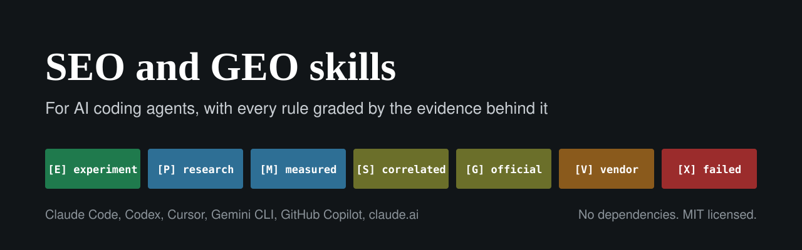

<p align="center">
  
</p>

<p align="center">
  <a href="https://github.com/rankxai/seo-geo-skills/actions/workflows/ci.yml"></a>
  <a href="LICENSE"></a>
  <a href="https://github.com/rankxai/seo-geo-skills/releases"></a>
  
</p>

# SEO and GEO skills

Two skills for AI coding agents that help you get a website found by Google and cited by ChatGPT,
Perplexity, Claude, Copilot, Gemini and AI Overviews. Every rule says how strong the evidence behind
it is, from a controlled experiment down to "tested and it failed", and links to the study or the
vendor's own documentation. The checks run in plain Node with nothing to install.

The most quoted GEO study (Aggarwal et al., KDD 2024) is often cited for "cite your sources", yet
its own [Table 1](https://arxiv.org/abs/2311.09735) ranks quotation addition first. llms.txt,
schema and keyword density are still sold as AI-search levers after measurement found no effect.
These skills keep fewer rules than the usual SEO checklist, and each one carries its source and
the date it was last checked. Everything here was re-read on its
primary source on 29 September 2026.

## Some things you will find inside

- The crawlers behind ChatGPT, Claude and Perplexity ran no JavaScript in the largest measurement
  of AI crawler traffic ([Vercel and MERJ](https://vercel.com/blog/the-rise-of-the-ai-crawler),
  about 1.3 billion fetches, December 2024). Googlebot, Bingbot and Applebot do render. Content
  that only appears after your scripts run is invisible to the crawlers behind ChatGPT, Claude and
  Perplexity.
- Blocking GPTBot does not remove you from ChatGPT search; blocking OAI-SearchBot does
  ([OpenAI's crawler page](https://developers.openai.com/api/docs/bots)).
- Google-Extended controls training, not AI Overviews. Since 31 August 2026 Search Console's
  "Search generative AI" setting decides that, and it must stay on Include for a site to appear
  ([Search Console Help](https://support.google.com/webmasters/answer/16908024)).
- Bing uses `noarchive` to keep a page out of Copilot answers, and Google ignores it. BBC News sends
  `X-Robots-Tag: bingbot: noarchive` (our audit, 29 September 2026).
- From 15 September 2026, choosing Block for AI training in Cloudflare also blocks Googlebot,
  Bingbot and Applebot, because Cloudflare now classifies crawlers by every purpose they have
  ([Cloudflare](https://blog.cloudflare.com/accountable-mixed-use-ai-crawlers/)).
- 97% of llms.txt files received no requests at all in server logs across 137,000 domains
  ([Ahrefs](https://ahrefs.com/blog/llmstxt-study/), 2026).
- Adding schema to 1,885 already-cited pages did not raise AI citations against about 4,000
  controls ([Ahrefs](https://ahrefs.com/blog/schema-ai-citations/), a matched study, not a
  controlled test).
- In a SearchPilot split test, a "key takeaways" block raised AI referral traffic and cost an estimated 6.5% of
  Google organic sessions ([SearchPilot and Omio](https://www.searchpilot.com/resources/blog/lose-google-and-you-lose-ai-search)).
- Two runs of the same prompt return the same list of brands less than 1 time in 100, so tracking
  "AI rank" with single prompts measures noise ([SparkToro and Gumshoe](https://sparktoro.com/blog/new-research-ais-are-highly-inconsistent-when-recommending-brands-or-products-marketers-should-take-care-when-tracking-ai-visibility/),
  2,961 runs).

## Install

Any agent that reads Agent Skills (the installer needs Node 22.20 or later; the checks themselves
run on Node 18 or later):

```bash
npx skills add rankxai/seo-geo-skills
```

Or copy the two folders in `skills/` into `.agents/skills/` in your project. Codex, Cursor, Gemini
CLI, GitHub Copilot and Antigravity all read that folder. Claude Code reads `.claude/skills/`.

<details>
<summary><b>Claude Code</b> (as a plugin, updates with the repo)</summary>

```bash
claude plugin marketplace add rankxai/seo-geo-skills
claude plugin install rankx-seo@rankx
```

Inside a session, `/plugin marketplace add` and `/plugin install` do the same.

</details>

<details>
<summary><b>Codex</b></summary>

```bash
codex plugin marketplace add rankxai/seo-geo-skills
```

Then run `/plugins` in Codex, open the RankX AI tab, install `rankx-seo`, and start a new session.

</details>

<details>
<summary><b>GitHub Copilot</b></summary>

```bash
gh skill install rankxai/seo-geo-skills --all
```

`gh skill` is in preview. For Copilot CLI as a plugin:
`copilot plugin marketplace add rankxai/seo-geo-skills`, then
`copilot plugin install rankx-seo@rankx`.

</details>

<details>
<summary><b>Cursor</b></summary>

Copy the two folders in `skills/` into `.cursor/skills/` or `.agents/skills/` in your project, or
`~/.cursor/skills/` for every project.

</details>

<details>
<summary><b>Gemini CLI</b></summary>

```bash
gemini extensions install https://github.com/rankxai/seo-geo-skills
```

</details>

<details>
<summary><b>claude.ai</b></summary>

Turn on Code execution and file creation (Settings, Capabilities). Download `seo-geo.zip` and
`content-review.zip` from the [latest release](https://github.com/rankxai/seo-geo-skills/releases/latest),
then go to Customize, Skills, "+", Create skill, Upload a skill, once for each zip. The scripts
accept saved HTML files as well as URLs, for when the sandbox has no network access.

</details>

<details>
<summary><b>Without an agent</b></summary>

```bash
git clone https://github.com/rankxai/seo-geo-skills
cd seo-geo-skills
node skills/seo-geo/scripts/audit-page.mjs https://example.com
```

Node 18 or later. Nothing to install.

</details>

Then ask your agent something like *"why isn't example.com showing up in ChatGPT?"*

## What a check looks like

`audit-page` run against the BBC News home page on 29 September 2026 (abridged; the full report
and the others are in [examples/](examples/)):

```text
$ node skills/seo-geo/scripts/audit-page.mjs https://www.bbc.co.uk/news

audit-page  https://www.bbc.co.uk/news  (HTTP 200, 1,096,883 bytes)

  WARN   html-size: HTML is 1.10 MB uncompressed, over half of Googlebot's 2 MB fetch limit
  WARN   heading-levels: heading level skipped: h1 then h3
  WARN   bing-noarchive: X-Robots-Tag "bingbot: noarchive": noarchive keeps this page out of
         Microsoft Copilot answers. Google ignores it. As written, it applies to bingbot only.
  WARN   lcp-lazy: the first  in the page has loading="lazy"
  info   server-text: 20637 characters (3330 words) of visible text in the raw HTML
  ...
```

One of those warnings is a policy choice worth knowing about: the BBC keeps its news pages out of
Copilot answers. Findings are graded rather than rolled into a score out of 100, so you can tell a
decision like that from a defect.

## What you get

`seo-geo`: the rules for making a page and a site findable and citable, plus six checks.

| Check | What it tells you |
|---|---|
| `audit-page` | Is the content in the raw HTML (what ChatGPT, Claude and Perplexity actually read)? One H1, heading order, title, description, canonical, robots directives including Bing's `noarchive`, images, structured data including types Google has retired, the 2 MB Googlebot limit, hidden characters, and whether the first paragraph opens with a question or preamble instead of an answer |
| `check-crawlers` | Your robots.txt read the way RFC 9309 says, for 26 AI and search crawlers and 2 control tokens from 12 vendors, grouped by purpose (training, search, user fetch). With `--live` it fetches your page as each crawler and compares the answer with a normal browser, a quick way to spot a CDN that blocks by user agent; `check-logs --verify` shows what the real crawlers got |
| `check-sitemap` | Every URL in every sitemap: returns 200, no redirect, no `noindex`, canonical matches. Also catches `lastmod` dates stamped on every deploy, which teaches Google to ignore them |
| `crawl-site` | A polite, capped crawl: broken internal links and fragments, redirect chains, orphans, pages missing from the sitemap, duplicate titles and descriptions, click depth |
| `analyze-gsc` | Search Console exports read offline: striking-distance queries, pages with impressions and no clicks, low click-through against your own position curve, queries split across pages (API exports), and the 28-day trend |
| `check-logs` | Which crawlers really visited, verified against the vendors' published IP ranges, and what status codes they got |

`content-review`: an adversarial review for articles and pages before they ship, plus three
checks.

| Check | What it tells you |
|---|---|
| `check-prose` | Machine-sounding phrasing, em dashes, invisible characters, figures with no source, and claims known to be false |
| `check-sources` | Fetches every link in a draft and sorts them into dead, alive and "could not check", without calling a bot-blocked page dead |
| `check-overlap` | Sections on different pages that answer the same question and compete for the same citation |

Anything a check could not verify is reported as "not checked", never as a pass.

## Evidence grades

| Grade | Meaning |
|---|---|
| [E] | Controlled experiment: someone made the change and measured it against controls |
| [P] | Peer-reviewed research |
| [M] | Directly measured: crawler logs, API instrumentation, court records |
| [S] | Large correlation study. Tells you direction, not dose |
| [G] | Official platform documentation |
| [V] | Vendor study. Useful, and conflicted |
| [X] | Tested and found not to work, or failed to replicate |

## Things to ask your agent

- "Why isn't my site showing up in ChatGPT?"
- "Audit https://example.com for SEO and AI search, and fix what you find."
- "Check our robots.txt for AI bots. Is our CDN blocking any of them?"
- "Crawl our site and find broken links and orphan pages."
- "Here is our Search Console export. Which pages are closest to page one?"
- "Review this blog post before I publish it. Recheck any statistic older than a month."
- "Which of our blog posts compete with each other for the same question?"

## What is inside

```text
skills/
  seo-geo/
    SKILL.md                      the rules that apply to every page
    references/                   page fields and schema, authority and links, delivery and
                                  crawlers, measurement, AI shopping, site-level work, sources
    scripts/                      audit-page, check-crawlers, check-sitemap, crawl-site,
                                  analyze-gsc, check-logs
    data/crawlers.json            26 crawlers, 2 control tokens and 2 agents robots.txt cannot address:
                                  purpose, user agent, robots.txt behaviour, vendor docs
    data/google-changes.json      42 Google Search changes since February 2026, each quoted
                                  from a Google page
    data/ai-platform-changes.json 36 changes at OpenAI, Anthropic, Perplexity, Microsoft, Apple,
                                  Meta and Cloudflare, each quoted from the vendor's own page
    data/myths.json               widely repeated false claims, with the source that settles each
  content-review/
    SKILL.md                      the pre-publish review
    references/                   writing guide, full audit checklist
    scripts/                      check-prose, check-sources, check-overlap
```

## How it stays current

Before this release every figure in both skills and every entry in the data files was re-read on
its primary source, and each data file records the day it was last checked. Correlation studies
are labelled as correlation, because "pages that get cited have X" is not advice until someone adds
X and measures. Each check has tests with examples it must catch and examples it must leave alone,
and those tests are confirmed to fail when a rule is broken on purpose. CI runs the prose checker
over the Markdown in this repo, so the docs are held to the same style rules as the drafts they
review (docs mode skips the figure and readability checks).

Found something out of date?
[Open an issue](https://github.com/rankxai/seo-geo-skills/issues/new?template=claim-is-wrong.yml)
with the primary source.

## Questions

**Do I need a RankX AI account or an API key?** No. Nothing here calls an API that needs a key.

**Does it send my data anywhere?** The scripts fetch only the URLs you give them (and the pages,
sitemaps and robots.txt files those lead to on the same site), and read only the files you point
them at. See [SECURITY.md](SECURITY.md) for the user agents they send.

**Why is there no score out of 100?** A score hides which engine, which page and how strong the
evidence is. Graded findings tell you what to fix first.

**How current is it?** Each data file records when it was last checked (`last_verified` on the
file, or `checked` on each myth) and each skill has a `last-verified` field. Platforms change their
guidance often, so treat anything more than a month old as due for a recheck.

## How this compares

If you want a broad audit suite with a 0 to 100 score, parallel agents and paid API integrations,
[claude-seo](https://github.com/AgriciDaniel/claude-seo) covers far more ground. This repo is
deliberately narrower: two skills, rules graded by their evidence, no score, no API keys and no
account. It borrows from claude-seo's list of Google updates, re-checked entry by entry (see
[NOTICE](NOTICE)).

## Limits

- These are page-level and site-level checks, not a rank tracker. They cannot tell you whether an
  assistant cites you today; for that you need many prompts, run repeatedly, over time, and the
  seo-geo skill's measurement section explains how.
- `audit-page` reads raw HTML on purpose, because that is what most AI crawlers read. If your
  content only appears after JavaScript runs, the audit will say so.
- Nothing here can guarantee rankings or citations, and Google's own guidance on third-party SEO
  tools says to be wary of anyone who claims otherwise.

## Contributing

See [CONTRIBUTING.md](CONTRIBUTING.md).

## About

Maintained by [RankX AI](https://rankxai.com). We build AI search visibility tools, and these are
the rules and checks we run on our own site, published so anyone can use them without an account.

MIT licensed. See [NOTICE](NOTICE) for the open-source work this builds on.
